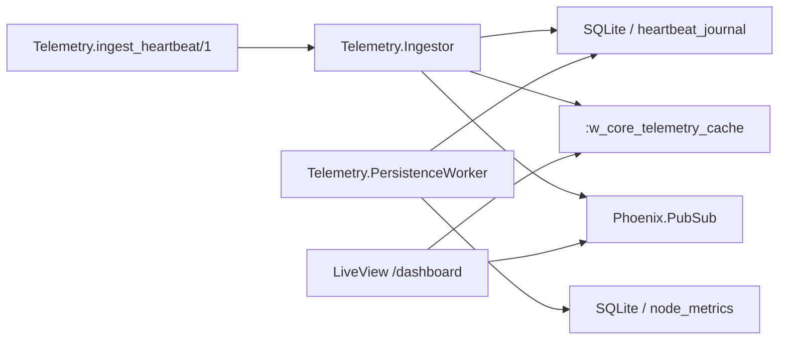

# W-Core

Motor de estado em tempo real para a Planta 42, implementado em Elixir + Phoenix LiveView, com autenticação via `phx.gen.auth`, leitura quente em ETS e persistência consolidada em SQLite.

## O que foi entregue

- Autenticação gerada oficialmente com `phx.gen.auth`
- Contexto `Telemetry` com `nodes` e `node_metrics`
- Ingestão de heartbeats por `Telemetry.ingest_heartbeat/1`
- `heartbeat_journal` em SQLite para durabilidade dos eventos aceitos
- ETS `:w_core_telemetry_cache` como camada quente
- `Telemetry.Ingestor` como único writer em memória
- `Telemetry.PersistenceWorker` fazendo write-behind periódico para SQLite
- Dashboard autenticado em `/dashboard`
- Teste concorrente com `10_000` eventos
- `mix release` + `Dockerfile` multi-stage
- Rascunhos técnicos em `/docs/drafts`

## Arquitetura resumida



## Como rodar localmente

```bash
mix setup
mix phx.server
```

Depois:

1. Acesse `http://127.0.0.1:4000`
2. Crie um usuário em `/users/register`
3. Entre no dashboard em `/dashboard`
4. Em desenvolvimento, os links de autenticação ficam disponíveis em `http://127.0.0.1:4000/dev/mailbox`

As seeds já cadastram sensores fixos e publicam alguns heartbeats iniciais para a demo.

### Observação sobre `127.0.0.1` vs `localhost`

- Para este projeto, o ambiente de desenvolvimento foi configurado para gerar links com `127.0.0.1:4000`
- O motivo é evitar conflitos locais em máquinas onde `localhost:4000` possa estar apontando para outro processo
- Para qualquer avaliador que rodar o projeto localmente, `http://127.0.0.1:4000` funcionará normalmente na própria máquina
- Em um ambiente publicado de verdade, o endereço passa a ser definido pela configuração de runtime, por exemplo via `PHX_HOST`

## Como simular heartbeats

```bash
iex -S mix phx.server
```

```elixir
node = WCore.Telemetry.list_nodes() |> List.first()

WCore.Telemetry.ingest_heartbeat(%{
  node_id: node.id,
  status: :critical,
  payload: %{"temperature" => 118, "rpm" => 980}
})
```

## Testes

```bash
mix test
```

Cobertura principal:

- contexto `Telemetry`
- reinicialização do `Ingestor`
- dashboard autenticado
- concorrência com `10_000` eventos
- suíte gerada de autenticação

## Docker / release

Build:

```bash
docker build -t w_core .
```

Run:

```bash
docker run --rm \
  -p 4000:4000 \
  -e SECRET_KEY_BASE="$(mix phx.gen.secret)" \
  -v w_core_data:/data \
  w_core
```

O banco fica persistido no volume montado em `/data`, com `DATABASE_PATH=/data/w_core.db`.

Depois de subir o container, o acesso local continua sendo feito em `http://127.0.0.1:4000`.

## Decisões de simplificação

- Sem endpoint HTTP de ingestão: a entrada oficial nesta versão é a API interna `Telemetry.ingest_heartbeat/1`
- Um único `GenServer` escritor para simplificar concorrência e explicação
- Cada heartbeat só recebe `:ok` depois de ser gravado no `heartbeat_journal` do SQLite
- O worker continua assíncrono, mas consolida o `heartbeat_journal` em `node_metrics` em vez de depender exclusivamente da ETS
- `status` vem do heartbeat; não há engine de thresholds
- Não existe histórico analítico bruto de eventos; o `heartbeat_journal` é uma fila durável transitória e é drenado após a consolidação
