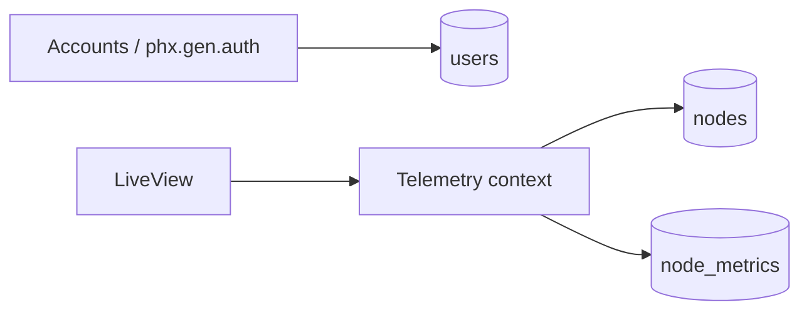

# Step 1 - Foundation

## O que foi implementado

- Aplicação Phoenix LiveView criada com SQLite
- Autenticação gerada via `phx.gen.auth`
- Contexto `Telemetry` criado com `nodes` e `node_metrics`
- Seeds com sensores fixos para a demo

## O que mudou na arquitetura

- `Accounts` ficou isolado do domínio operacional
- `Telemetry` passou a ser o boundary da planta
- `nodes` representa cadastro estático
- `node_metrics` representa o último estado persistido por nó

## Trade-offs e decisões

- Usei `phx.gen.auth` sem customizações profundas para cumprir o requisito e manter a base fácil de explicar
- Removi `user_id` de `nodes` e `node_metrics` porque os sensores pertencem à planta, não ao operador logado
- Não desenhei histórico analítico bruto de eventos na fundação
  O foco inicial ficou no estado consolidado; a trilha durável de heartbeats foi adicionada depois, no passo 2, como journal transitório para garantir recuperação após restart
- Mantive `machine_identifier` único
  Isso simplifica seeds, lookup e demonstra que o cadastro é estático
