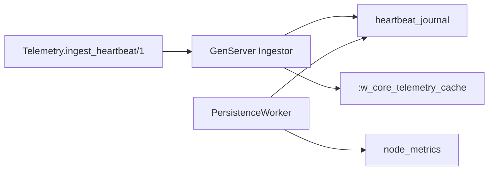

# Step 2 - OTP e ETS

## O que foi implementado

- `Telemetry.Supervisor` com estratégia `:rest_for_one`
- `Telemetry.Ingestor` como único processo escritor
- ETS `:w_core_telemetry_cache`
- `heartbeat_journal` como trilha durável dos heartbeats aceitos
- `Telemetry.PersistenceWorker` fazendo write-behind periódico
- Reidratação da ETS a partir do SQLite no boot

## O que mudou na arquitetura

## Trade-offs e decisões

- Escolhi `:set` + `:protected`
  `:set` porque a chave natural é `node_id`; `:protected` porque só o `Ingestor` escreve, mas qualquer leitor pode consultar
- Escolhi um único writer
  É menos performático que particionar a ingestão, mas muito mais fácil de defender e elimina race conditions na atualização do tuple
- Cada heartbeat só é aceito depois de gravado no `heartbeat_journal`
  Isso remove a janela de perda entre memória e banco; em caso de restart, a ETS volta com `node_metrics` mais os eventos pendentes ainda não consolidados
- O worker passou a consolidar o journal, não a varrer a ETS
  Mantive o write-behind pedido no desafio, mas com durabilidade explícita antes do ack
- Usei `:rest_for_one`
  Se o `Ingestor` cair, o worker reinicia junto para reencontrar a ETS recém-criada
- A validação de nó existente fica em memória
  O `Ingestor` carrega os `node_id`s válidos no boot e evita consulta ao SQLite a cada heartbeat
