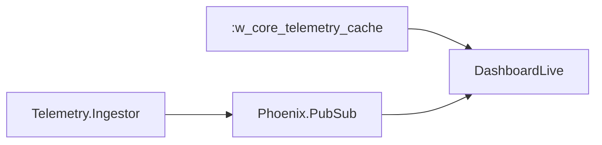

# Step 3 - LiveView e Design System

## O que foi implementado

- Dashboard autenticado em `/dashboard`
- Componentes HEEx próprios: `status_badge`, `metric_card`, `node_row`, `empty_state`
- Atualização visual por PubSub para mudança de status
- Refresh leve a cada `1s` para contadores e `last_seen_at`

## O que mudou na arquitetura

## Trade-offs e decisões

- O dashboard lê estado quente da ETS, não do banco
  Isso mantém a tela alinhada com a exigência de reação imediata
- O PubSub só dispara em transição de status
  Se eu publicasse todo heartbeat, o fluxo de renderização ficaria muito mais barulhento sem ganho proporcional
- O refresh de `1s` foi mantido propositalmente simples
  Evita inventar granularidade mais complexa e mantém contadores visíveis sem lotar o PubSub
- O frontend foi mantido em HEEx + Tailwind puro
  Removi dependências de UI de terceiros para aderir ao requisito de componentes próprios e deixar o design system mais fácil de explicar
- Os componentes HEEx foram mantidos pequenos
  A ideia aqui foi clareza, não um design system super genérico
