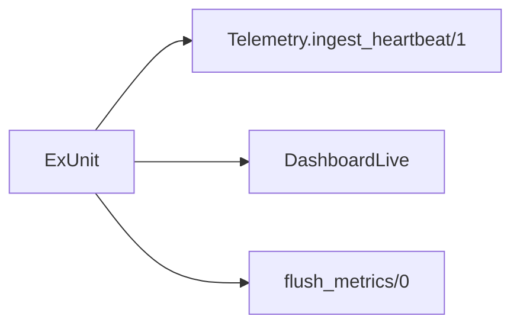

# Step 4 - Testes

## O que foi implementado

- Testes do contexto `Telemetry`
- Teste LiveView autenticado para `/dashboard`
- Teste de reinício do `Ingestor`
- Teste de reinício antes do flush para provar recuperação via journal durável
- Teste concorrente com `10_000` heartbeats

## O que mudou na arquitetura

## Trade-offs e decisões

- Mantive o teste de carga em cima da API de domínio
  Isso prova o motor sem introduzir ruído de controller ou rede
- Adicionei `flush_metrics/0` e `reload_state/0`
  São ganchos simples para tornar a suíte determinística
- Reseto o estado do `Ingestor` a cada teste
  Como ETS e GenServer vivem fora da transação SQL, isso evita vazamento de estado entre cenários
- O teste concorrente distribui eventos entre poucos nós
  Isso deixa a asserção de contagem fácil de explicar e ainda pressiona a serialização do writer
- A suíte agora cobre restart antes do flush
  Isso prova que um heartbeat aceito sobrevive no `heartbeat_journal` e volta para a ETS mesmo se o worker ainda não tiver consolidado o estado
