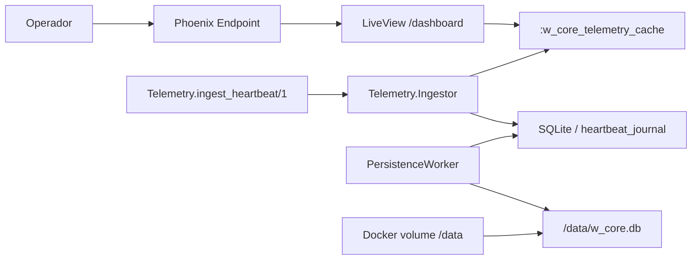

# Step 5 - Infra e Release

## O que foi implementado

- `WCore.Release.migrate/0` para rodar migrations em release
- `Dockerfile` multi-stage
- Volume persistente em `/data`
- `DATABASE_PATH` apontando para `/data/w_core.db` em produção

## O que mudou na arquitetura

## Trade-offs e decisões

- Usei `mix release` puro
  Mantém a entrega alinhada ao stack do desafio e reduz dependências extras
- O container roda migrations antes de subir a aplicação
  Isso simplifica o primeiro boot sem exigir um passo manual fora do container; a release usa `WCore.Release.migrate/0` antes de iniciar o servidor
- O arquivo do banco fica em volume externo
  Assim o estado persiste entre restarts do container, que é uma exigência explícita
- O volume agora protege tanto o estado consolidado quanto o journal pendente
  Como cada heartbeat aceito entra primeiro no `heartbeat_journal`, um restart do processo não perde eventos já reconhecidos pela aplicação
- Mantive o Dockerfile pequeno
  A meta era explicar bem a cadeia de build e runtime, não montar uma imagem hiper otimizada e mais difícil de justificar
